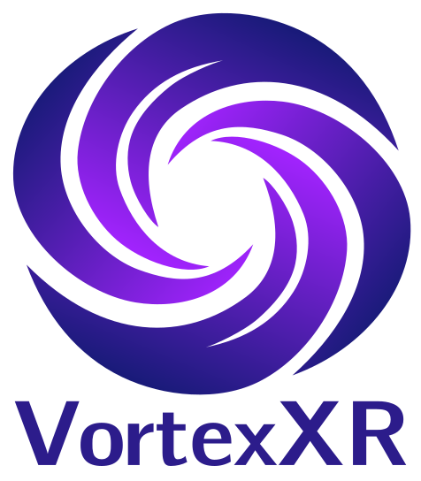
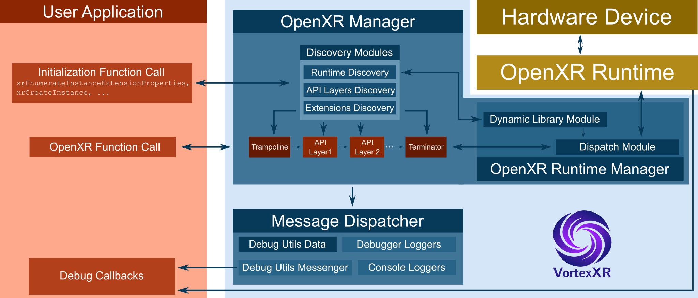

# VortexXr: An OpenXR™ loader

  

VortexXR is an OpenXR™ loader library that implements the [OpenXR™ specification](https://registry.khronos.org/OpenXR/) and provides a clean interface between XR applications/engines and platform runtimes for Augmented and Virtual Reality (AR/VR) hardware.

It is designed to simplify integration with OpenXR™ by acting as the intermediary layer between your engine or application and the underlying XR runtime, enabling consistent access to AR/VR devices across platforms.

OpenXR™ is the de facto industry standard for XR development, widely adopted across modern engines, tools, and immersive applications.

VortexXR is primarily developed with the [C4 Engine](https://c4engine.com/) in mind, but it is intended to function as a drop-in replacement for the Khronos OpenXR loader, offering compatibility with existing OpenXR-based workflows while maintaining flexibility for engine-level customization.

This software requires the [Json4C4 library](https://github.com/nasosi/Json4C4). When not used within the C4 Engine environment, it also requires the [Terathon Container Libraries](https://github.com/EricLengyel/Terathon-Container-Library).

## Library Architecture

The architecture of the VortexXr library is shown in the figure below.

  

A call to an initialization function from the user application typically triggers discovery of the OpenXR™ runtime, available API layers, and supported extensions. Successful discovery results in loading the runtime and API layer libraries, as well as populating the dispatch tables and extension property lists.

A call to a command function is routed through a trampoline layer responsible for dispatching the call to the first (topmost) API layer. Functions not intercepted by an API layer bypass it and are forwarded to the next intercepting layer, or ultimately to the terminator.

The terminator then invokes the appropriate dispatch procedures from the runtime manager, which maintains the addresses of the relevant runtime functions.

The message dispatcher handles logging and is also responsible for forwarding debug utility messages, registered by VortexXR or the runtime, back to the user application.
